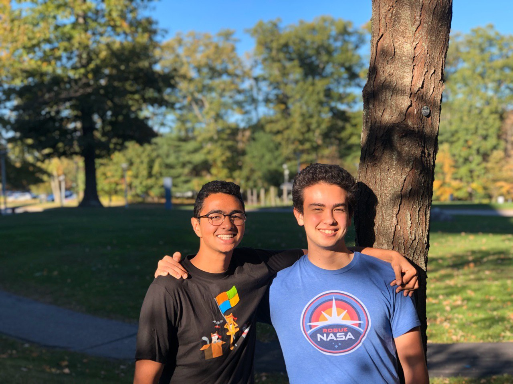
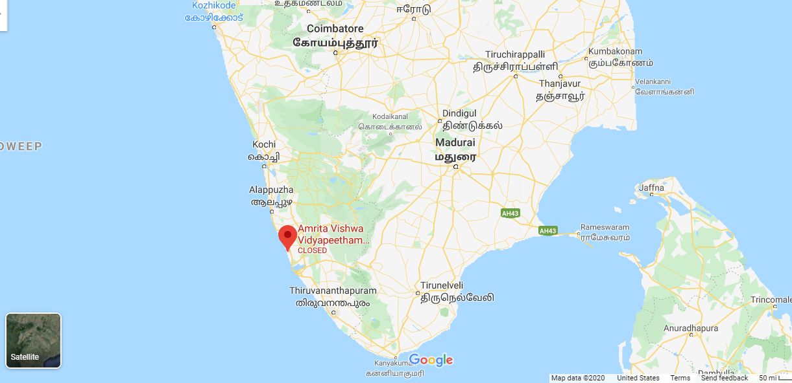
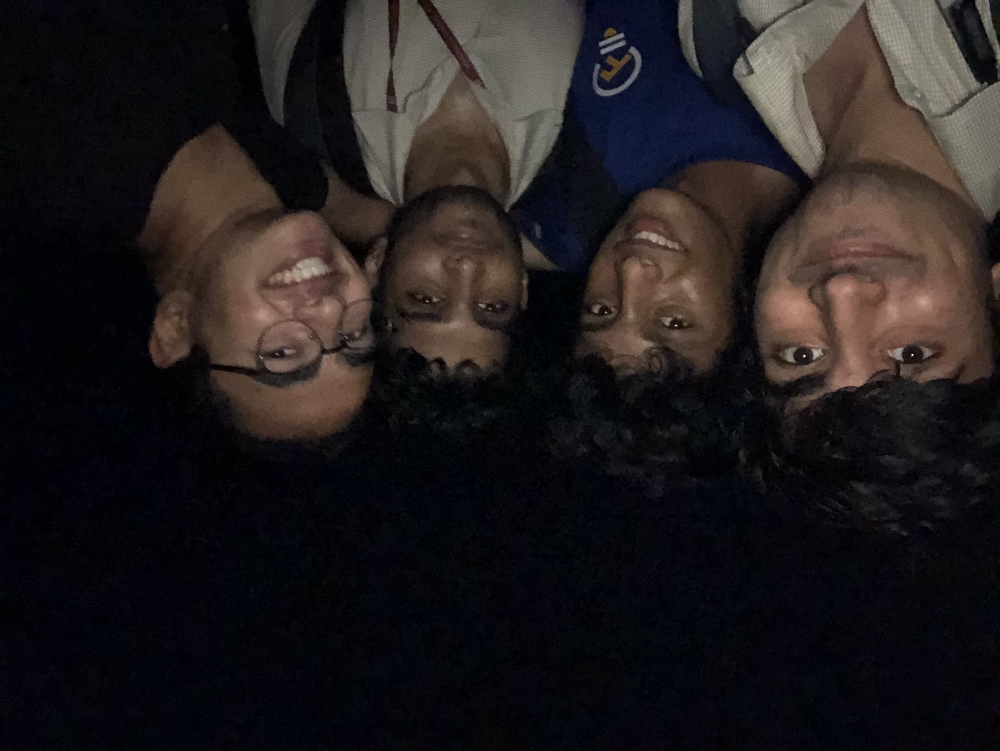

What’s up folks. For those new to this blog / who we are, good to see you here! Eamon and I are  both first year students at the Olin College of Engineering at the time of publishing. 

**This post reached the front page of [Hacker News!](https://news.ycombinator.com/item?id=25549290) Check out the comments there :)**

## The ‘abstract’ - a big picture overview of what we did:

Over our first semester at Olin, in an entrepreneurial spirit we learned and redeveloped Corewars: a 30 year-old computational-thinking game. Corewars was fascinating because of its potential to be used as a powerful logical programming framework. The way players could use simple assembly commands to execute code visually and manipulate data held much promise for complex logical problem-solving both in a competitive or collaborative nature. 

After eye-opening discussions with Indian engineering and computer science professors, it appeared that there was a need for a scalable method to build students’ creative problem solving skills. We developed Corewars as a game-based educational software, similar to MIT’s Scratch in some ways. At the end of the semester, as Adi had a chance to visit India, we completed development and used the game as a teaching tool for undergraduate computer science students. We tested the game and pedagogy by presenting the approach and teaching the game to groups of professors and students in person at India’s premier private research university.

**View what we [built in action](https://corewarstechalpha.herokuapp.com/) or the [source code](https://github.com/aramachandran7/corewars)!**

Below, we document our process, learnings, and what we seek to do in the future in detail.

  

*Eamon and I before we knew what we were getting ourselves into*

## The Backstory 

Last September, as two first-year engineering students who’d just hardly moved into Olin, Eamon and I realized we wanted to work together on “something something entrepreneurship”. It was vague, it was naïve, but it was genuine.

After a *painful* ideation process, echoed by other college students interested in entrepreneurship, we eventually settled in the education space. 

Adi had been talking with a machine learning professor, born and raised in the USA, who now teaches masters students at a top ranked private university in India. At the time, the professor, Amar, had been complaining about some of his masters students. 

They struggled to creatively problem-solve. 

Amar would give them an open ended engineering challenge - perhaps to optimize a device for weight, or to increase the efficiency of an algorithm. Instead of asking follow up questions, inspecting the device or reading through the algorithm, most of Amar’s students would ask him one simple question. 

*‘Sir, what is my next step?’* 

Students would have the tendency to expect to be spoon fed; they were expecting problems like what you’d find in a text book, where Amar would have the answers and he was simply waiting for them to get the problem right or wrong. 

**Yet no engineering projects or challenges or jobs are like this** - they’re open ended, require creativity, problem-solving and collaboration skills (yes, let’s just throw all the buzzwords in). 

**We’ve heard that from a young age, many Indian students are taught by the education system that education is the ability to pass tests and memorize or ‘mug’ facts, formulas, or spellings.** 

For Amar, he could spend hours with each student in 1:1’s, working through open-ended challenges and helping his students develop a better creative edge. But no professor has that amount of time. Moreover, we believed that Amar’s problems were echoed throughout the country. **Our question became, how do you build creative intuition for students, at scale and cheaply?**

So that was it. Naively, we set out on our journey to solve what we liked to call the ‘creativity-problem’ in the Indian education system. Get students to problem solve with an entirely different mental framework. Somehow figure out a curriculum or an exercise radical enough to undo ~14 years of teaching. 

And on top of all this, whatever we made magically needed to be business-viable. We needed to balance our desire for solving important social problems with creating a sustainable product that people would use.

## The Start

Initially, we knew nothing about the space, other than what Amar had told us. Therefore, we figured we had to start with talking to people. We assumed that because of the very bureaucratic state of the majority of India’s top  engineering / technical institutions, selling any software to institutions / universities would be downright impossible. 

And students wouldn’t be the ones paying for software like this - they had no idea that the ‘creativity-problem’ was even a problem. Thus professors became our target market. **Talking to Indian engineering professors was our first step.** Through one connection or another, we tracked down and interviewed a number of engineering and computer science professors from IIT, NITT, BITS Pilani, and a couple other highly ranked Indian engineering schools.

While verifying the ‘creativity-problem’ was the focus of our interviews, we focused on asking open-ended questions to get a better feel for the space we were in. 

Our interviewing style and questions looked something like this. 

*Describe, in-depth, some of the problems within the undergraduate engineering education system? What about solutions you’ve seen? If you could change one thing about the system, what would it be?* 

*Questions about students - What do you like about your students? What do they do particularly well in? What does your ideal class / teaching style look like, and what is it usually like? What’s preventing you from achieving this?*

To summarize our interviews, Indian professors described to us a world unlike anything we’d ever seen. It almost seemed like if we had been interested in the Indian higher ed space, Amar wouldn’t have been the right person to start off with. He was an extreme early adopter, an extreme edge case with very progressive educational opinions. Most of the professors we talked to were nothing like him, and appeared mostly ok with the status quo. 

And after talking to a few students, the picture changed more, both filling in some gaps, but also confusing us even more. 

Here’s a rough picture we formed in our heads combining what we heard from engineering/CS students and professors. 

- The overall large lecture hall environment isn’t conducive to students being engaged in class. Although teachers complain about some of their students’ internal motivation for learning, teachers themselves often aren’t thinking about feedback or changing their own instructional styles. 
- While not the case in every college, in certain courses the only metric for student learning is the final - incentivizing students to not attend lectures and memorize the content the night before. 
- And lastly, for many students, college represents a tremendous amount of newfound freedom. This can mess with their ability to study, work hard, and stay motivated; and oftentimes, a student culture of procrastination and disengagement can be prominent and even will spread to motivated students. 

These problems are really tough. We were taken aback after hearing the students’ perspectives the first time, especially coming from a place like Olin. 

But Amar had convinced us that these were problems worth solving, no matter their difficulty; giving up was not an option. We decided that we wanted to brainstorm more and try mashing together our ideas with some of the problems we’d heard through interviews. 

Here are the needs that we believed professors had.

- Reduce what we called the Gap - incoming undergraduate engineering and CS students' backgrounds, motivation, and pre-existing knowledge was extremely varied, and resulted in some students not being satisfied with the content. 
- Increase student motivation - from the professors’ point of view, many students weren’t there to do much other than pass the tests.  
- Enable professors to engage more closely with students’ current culture - professors felt like they were out of sync with the students and their habits.  
- Increase employability - how easy it was to get a job out of college was a key metric that was brought up by professors several times. 

## What we decided to do: 

With this all in place, we decided to move forwards with a *game based software* that: 

- Would have a low ‘barrier of entry’
    - Be easy for students from any background to pick up 
    - Be visual and simplistic to wrap your head around
    - Have some level of a competitive / addictive nature and well defined metrics of success
- Act as a teaching tool to build students’ creativity and collaboration skills
- Be at least tangentially related to engineering / CS 
- Have a way for teachers to track progress, assign grades, etc. after giving it to students as a ‘homework’ assignment

**Games still require the open-ended problem solving that makes projects so hard, but at the same time don’t require learning technical skills.** This meant that students could focus on learning and practicing problem solving skills, without the overhead of having to pick up new technical skills.

We decided to rebuild, reimagine, and repurpose an old computer game - Corewars - for the task. Corewars is a game from the 80’s, where two programs fight it out over a limited memory buffer. It’s interesting because the programs exist within the same memory buffer that they are trying to take over -- each program’s code can be modified, overwritten or even hijacked by the opponent. The programs themselves are written in a pseudo assembly language called Redcode, with 23 commands including simple operations like adding and multiplying, to more complicated ones that can create new processes or copy memory.

The technical challenges we faced can be broadley broken up into backend and frontend implementation. For the backend, we had to create what was in essence a simple assembly compiler. It would have to take in two processes written in Redcode, then execute them in an empty memory buffer. For the frontend, we had to create a clear visualization of what the processes were doing, and also had to build a UI that allowed for intuitively creating programs in Redcode. The latter was especially important for us as the goal for this project was to require as little technical experience as possible, and we also knew that Corewars was a challenging game. Building an intuitive UI that could allow people to play without background knowledge would go a long way.

**To get into some of the details, I’d recommend you visit our [codebase on Github](https://github.com/aramachandran7/corewars) or [check out the final product!](https://corewarstechalpha.herokuapp.com/).** It’s entirely open source, and if you’re interested in contributing in any way, we’d love it! The entire project’s UI and functionality is written in React, which calls a number of Javascript classes that each represent a Redcode operation used to build a player’s warrior. 

We built in a number of features to increase Corewars’ playability, like an In Game Messages Section, a set of example Warriors to choose from, and a Beginner and Debug Mode. 

We also added a high visibility into the game’s logic and processes, where users could play, pause, and stop the game logic, and also hover over individual memory cells to view the commands and data stored within. We used a combination of react stateful components to handle the UI pages and React PureComponents to display individual memory cells. 

We’ve also included an instructions guide to walk new players through building their first warrior. 
Again, please feel free to check out our codebase or play around with the final product here!

## The Deployment

Amar was kind enough to let us visit and deploy our software at his university, Amrita University in Kochi, India. Amrita University is the #1 ranked private university in all of India, and has highly ranked engineering and CS programs in the country as well. 

*Amrita University on a map*

*A picture of the sunrise from the tallest building in the area*

Adi ended up traveling to India over break, while Eamon practiced WFH and remotely contributed to the deployment and software development from his home in LA. 

In addition to providing resources and putting us in touch with some of the coolest individuals on campus, Amar acted as a mentor and Adi’s personal guide to better experiencing Kochi culture. Spending 2 weeks on campus, eating their food, going to classes, talking to professors, and discussing educational philosophy was amazing. 

After about a week and a half of onsite development where we were actively building the UI in with real time feedback from outside users, we felt we were ready to ‘deploy’. Instead of beginning deployment inside a traditional classroom, after an initial showing with some higher up’s in the CS department, we decided to try deploying with an on campus group more comfortable with CS basics - Amrita University’s Free and Open Source Software Club [(AmFoss)](https://amfoss.in) club. 

AmFoSS is one of the top CS clubs in the country; members meet every day to work on building and contributing to open source software projects. They’d be a perfect example of Corewars early adopters. 

After a demonstration of Corewars in front of the club on day one, and a quick feedback session and discussion, we all decided it would be interesting to get some of the students trying out the software and learning the game the next day. 

On day 2 of deployment, Adi spent an evening working with 2 groups of students, 2 and 3 students per group respectively, teaching them the game, working them through examples, and getting them to the point where they could play it confidently. 

Corewars worked surprisingly well for some things - and surprisingly poorly for others. For reference, view the [final product we demoed here](https://corewarstechalpha.herokuapp.com/). 

The learning tools we’d built into the platform - like being able to hover over a cell and view its value, or being able to play and pause the process while running - were incredibly valuable for the teaching process. And the potential of the game itself was impressive and a testament to the framework we’d built. 

Initially, we’d assumed that students would play Corewars competitively against each other, with a leaderboard. But from the deployment results, **it was clear that players could use the functions within the game to not only fight against opponents, but also solve challenging traditional logic problems - like LeetCode interview questions. **

However, despite several features designed to make the game easier, **Corewars proved itself really, really hard.** Learning the assembly commands and how they edited the A and B values of each memory cell, understanding how the processes were executed and how data was stored was incredibly challenging for students to wrap their heads around. 

Before deployment, we’d assumed that Corewars could be learned and played by students at a semi-competitive level within a sitting. Even with the beginner mode that featured a scoped back set of assembly commands and high visibility into the game’s processes, it took Adi **an hour and a half of 1:1 teaching time **within the groups to get them comfortable with the game. **We can estimate from this testing it would take students ~3 hours to learn the game individually, and another ~3-4 hours of logical challenge questions to get to a competitive level. **

**The entire idea of Corewars was that it would be scalable - and without a doubt, because of its sheer complexity, it was not.** 

On the other hand, despite the larger time investment, students learning Corewars would get valuable practice learning, visualizing, and mentally internalizing a complicated logic framework, similar to learning a new linear algebra concept or a low level programming language. They’d also get great practice at synthesizing complicated algorithms using the framework they’ve just learned. 

*Hanging out with some of the students I worked with - Kharan, Akshay, and Mayukh - they're great guys and a ton of fun❤️❤️*

## Lessons Learned

While Corewars was perhaps not as widely applicable as we hoped, there were a few core lessons we wanted to take away and share with you. 

We learned a **tremendous amount of contextual & cultural information** about India’s educational system, its people, and its challenges. **It was a privilege** to meet so many professors and students and understand their side of the story. 

From an entrepreneurial point of view, we learned first-hand the value in a couple things: 

- Qualitative first, *then* quantitative market research
- A real MVP - having the *absolute minimum* you need to test your concept out with your users. It doesn’t need to be a working product. 
- The immense benefit of being able to test your software rapidly, before and after every new feature is added. 
- Being a part of your target market - if we had been Indian professors, or even previously engaged in the Indian educational system, this project would have been significantly easier. 

From a technical standpoint: 
- While Eamon was already familiar with React, this was Adi’s first real foray into web development, JS, and React - lots of learning on that front.

And while we were off in India and rebuilding Corewars last semester, **Olin continued being an incredibly unique educational institution.** That’s one thing that we’ve realized we can never take for granted, and it’ll continue to be one our greatest innate, contextual strengths as entrepreneurs from Olin College.

## Moving forwards

To be frank - this was a really weird story. We never expected we’d be doing this, of all things, during our first winter break in college, but all we can say is that it’s been a good time. 

**Before moving on though, we just wanted to give a huge shoutout to Amar - none of this would have been possible at all without his help and guidance along every step of the way. He devotes and continues to devote a tremendous amount of time and passion to helping his students grow, and the time he spent with Adi in India was invaluable.**

**On top of Amar, Adi met with a number of incredible and inspiring professors and students at Amrita University that made Adi's time there a blast that he'll always remember. A shoutout to Randy, Gayatri, Akshay, Bipin, and Divin.**

We haven’t given up on our original, core goals - work on something entrepreneurial - perhaps establish a startup, learn a ton in the process, and do something in the edu space. 

We did, at least temporarily, abandon building software to attempt to solve the problems of the Indian education system. It was too out of reach, we were too disconnected, and while we certainly made extensive learning progress, we felt that for the future we wanted to work on something closer to home. There are ample unaddressed problems and pain points in the American higher ed system that needed solving - so we’ve been busy. 

At the moment, after a round of interviews with Olin professors, we’re thinking a little bit about a Git Version Control or github-esque software for storing, documenting, sharing and iterating on curriculum. 

But more on that in a later blog post. **Thanks for reading through the whole way** - and if you have comments, ideas, or opinions, always feel free to shoot them over to my email!

That’s a wrap, folks.