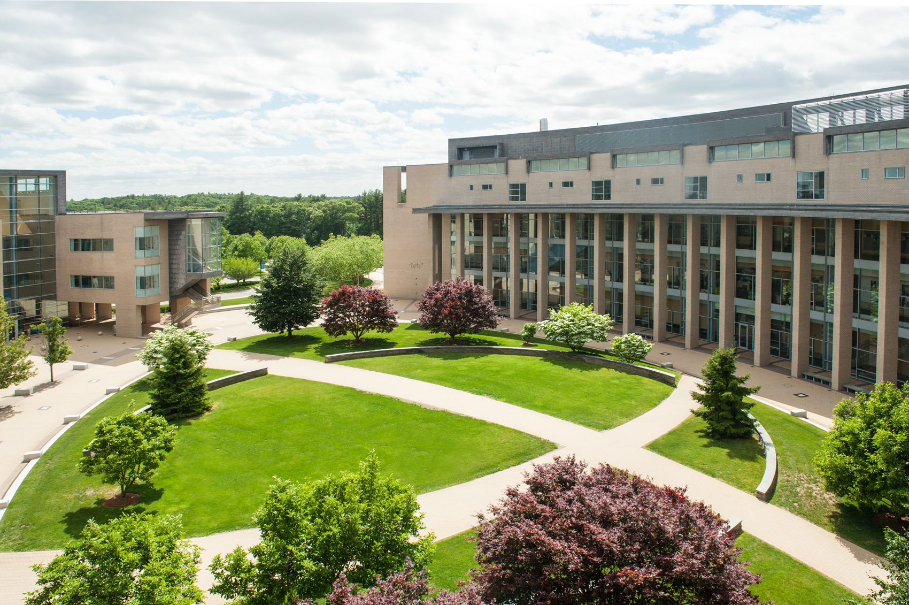
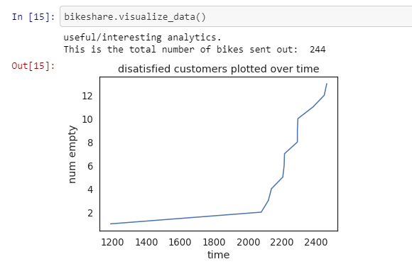
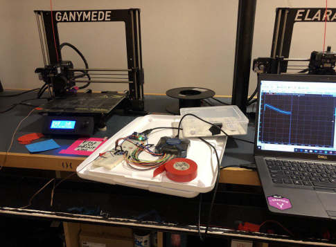
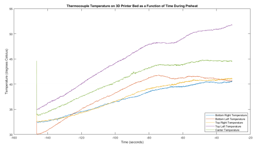
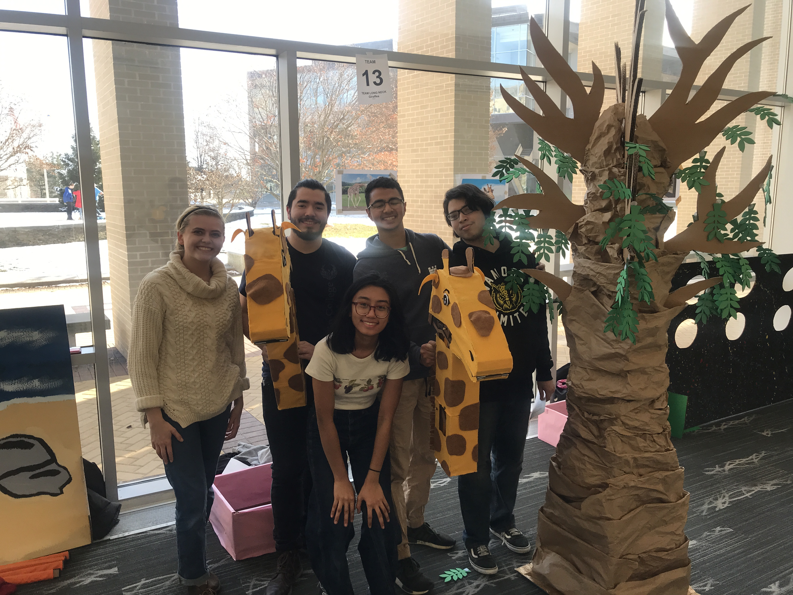
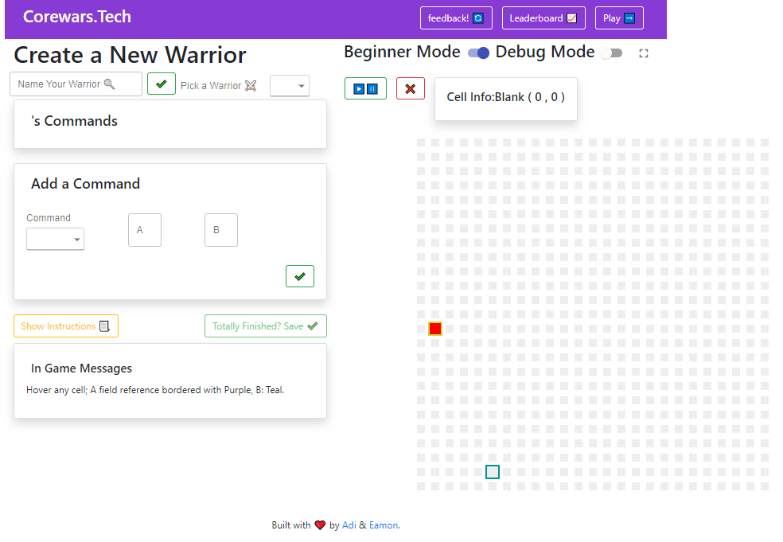

Welcome to my first blog of the twenties – and my first blog post ever.

Thanks for checking this out! Here's a quick table of contents:

**(If you're here for the projects, skip to the Projects Section.)**

## Table of Contents

[A semester by the Numbers](#a-semester-by-the-numbers)

[Some Olin Background](#some-olin-background)

[My Time Here](#my-time-here)

[My Projects!](#a-couple-of-my-projects)

[Wrapping Up](#third-example)

A super quick note before we start. In general, these blogs are an informal place for me to share my findings and express my opinions as a young engineering student who still doesn’t really have an idea about what he wants to do.

We’re gonna kick this off by talking about my first semester at the Olin College of Engineering. **Let’s start with some numbers, and then I’ll do some explaining.**

## A semester by the Numbers

- **My first semester by the numbers –**

- **0 Tests**

- **6 Major group projects**

- **18 Individual smaller projects & labs**

- **2 Hackathons**

- **8 Monster Energies**

- **(only) 2 All-nighters**

- **1.5 Ultimate tournaments**

- **2 Overnight trips to ~~Ivy Leagues~~ inferior universities**

- **1 Low voltage battery pack for an electric race car**

- **1 Badass roommate**

- **3.5 Websites**

- **1 Almost completed novel (written)**

- **Not enough trips outside of Olin**

- **2 Weeks of eating only salad for all meals**

- **1 New amazing group of friends!**

## Some Olin Background

Olin is by far one of the most unique, progressive engineering schools on the planet. I highly recommend you check out the website to learn more, but in summary...

We’re located just outside of Boston, Mass if you ever want to give us a visit.

Olin College is a pretty highly ranked engineering school with only undergraduates, a total student body of 400, and an entirely project based learning curriculum – we don’t have tests.

No tests. No finals. No midterms. Ever.

Just a f\*ckton of group projects.

On a side note I think I forgot what multiple choice _feels like._

I’ll spare you most of the details, but the college was started only ~ 20 years ago, in the hopes of providing students with an entirely reimagined college engineering experience. When it started, founder, faculty, and students had to collectively realize the college’s vision from scratch, laying out everything from the curriculum to the college culture to the social scene, to make the college what it is today.

  

Even today, the college still functions somewhat like a startup, where students have a huge say in how courses are taught and what content they actually teach, how a number of the clubs are run and spend their money, and the actual college culture itself.

We have a partnership with 2 other close-by universities – Babson College and Wellesley University – where we can enroll in business/entrepreneurship or liberal arts courses (respectively) and join clubs.

The school chooses to give first year students in their first semester a generally easier time, to smooth the transition between high school and college. We all take the same courses regardless of our intended concentration, and these courses are honestly pretty damn easy.

They aren’t nearly as theory heavy as the first-year courses will be at other engineering schools, and their workload is tiny compared to courses we’ll take later on at Olin – which gives students a lot of free time (in theory) to try out new clubs, opportunities, etc.

What we actually end up spending our time on is something else altogether.

Although I’ve only been through my first semester at this school, I’m really, really into it.

## My time here

I started off like most other first-year students not really knowing what to expect, other than the content on the admissions website. Since move-in day, I’ve been more than pleasantly surprised around every corner.

Olin is an incredibly socially welcoming community, with a surprisingly welcoming culture. Olin teaches its students (consciously and subconsciously) to never be afraid to embrace your identity - both with regards to individual students and the entire school culture.

Students have no problems sending out emails on blast to the entire student body, to announce unofficial events, parties, and or workshops they think will be useful.

The college culture itself is really f\*cking weird but also really f\*cking cool. I’ll give you just one quirky example of our culture.

On ‘California Day’, the youngest Californian at Olin, (who ended up being my roommate), leads the entire student body to run laps around the O (the center of campus) in only swimwear.

California day occurs once a year, on the first heavy snow of winter.

To give you a picture, a good 75 / 350, or 20% of the school participates, and proceeds to make snow angels and igloos afterwards, in only swimwear.

While traditions like California day may seem wild or cultish, it’s the people behind these traditions who really make the school what it is – and these people are ‘roughly’ as eccentric and bold as the little tradition I described above.

But beyond that, they’re some of the hardest working, most brilliant, and simply most _interesting_ people my age I’ve met. Ever.

I like to think that Olin’s admission process vets for diverse, passionate thinkers – and they do a damn good job of it, too. Oliners are incredibly passionate even before they come to college, and just hearing them speak about their time spent crab-fishing or founding businesses or winning national robotics competitions is mind-blowing.

My main regret from first semester is not spending enough one on one time with other Oliners, simply getting to know them better.

But I guess that’s what my next 4 years are precisely for.

## A couple of my projects

### Modsim Project 1

Olin’s Modeling and Simulation teaches the basics of modeling, system abstraction, and coding with Python 3. The course itself features 3 major projects, each dedicated to modeling a certain type of real-world system.

Project 1 – abstract system modeling (i.e. transportation systems)

Project 2 – modeling thermal systems (i.e. ocean warming)

Project 3 – modeling physical systems (i.e. projectile motion)

Our Modsim Project 1, where I worked with Xander Hughes, was by far my favorite - using Python and about 30 gigs of Citibike date we built a statistical model of the NYC CitiBike bikeshare system.
  

We based all of the values in our system off of probabilities and insights gathered from real CitiBike data, and nearly every parameter of the system was considered as a distribution around the real average, instead of a constant value, to match variance in the real world.

We wrote all our visualization functions and the entire model class framework to enable systematic, scalable, and customizable simulations.

Check out the project on [GitHub](https://github.com/aramachandran7/BikeshareModeling)!

### ISIM Final

Introduction to sensors, instrumentation, and measurement, the intro electrical engineering course at Olin. By far the most theory heavy / challenging first semester first year course for Oliners – but also a ton of fun.

For our final ISIM project Rohil Agarwal and I devised a simple thermocouple circuit, capable of reading temperature with high precision and low lag, using some custom filtering and amplification. The circuit was used with an Analog Discovery oscilloscope and Waveforms software to read and log the data in real time.

Subsequently, we used the above circuit as a measurement tool to fact-check the temperature accuracy of 3D printer print beds …
  

And we got some really interesting results.

As you might have guessed, a 3D printer bed doesn’t heat up evenly – the center heats up significantly more than the 4 corners; that’s the nature of how heat dissipates. Makes sense.

But more interestingly, our results indicated that the bed surface itself of the 3D printer we used for testing (a Prusa i3 MK2) didn’t actually heat up to the software temperature set point. The values we achieved in measurement were all 10-15 degrees Celsius lower than the 55-degree set point. Huh. Interesting…
  

For a deeper analysis, check out the full report [here](https://drive.google.com/open?id=1UT3qyti09_Lr63RikA0Q02RuGmth84XX)!

### The Desnat Play Experience

Design Nature, Olin’s introduction to mechE and design course, teaches the principles of design and gives students their first individual and real team projects at Olin. Through 2 projects that each take up half a semester, the curriculum walks students through the design process, from sketching, to sketch modeling, to prototyping, to fabrication of a final product.

The Desnat Play Experience project required teams of 5 students to collaborate and design a ‘play experience’ within a 9ft x 9ft area to engage and entertain groups of 4-5 fourth graders, based on an animal. At the projects’ completion, a group of ruthless 4th graders actually come to Olin, try out, and roast the play experiences.

I will note that 4th graders are incredible critics. This project is best explained [visually - check out this drive folder](https://drive.google.com/open?id=1U6TKJgSbrzZ-HdJAjwoHlbLDy0PzqYYH). :)

  

### Catalyst 'Edual' Project

My project partner, Eamon Ito-Fisher, and I spent a lot of time last semester and over break building and deploying an education related entrepreneurial project. At some point I’ll get around to writing an entirely separate blog post on this one too, as of all the projects listed here, this is IMO the most interesting, and also the only one still in progress.

We built a game-based teaching tool for professors, comparable to MIT's Scratch! We ported over a 1980’s coding game, Corewars, to a modern tech stack with a re-imagined UI. Our objective was to provide students with a collaborative logic game that increases their confidence in creative problem solving and collaborative algorithmic thinking.

We completed our MVP (Check out what we built [here](https://corewarstechalpha.herokuapp.com/)!), and actually had the amazing opportunity to deploy with [first-year CS students](https://amfoss.in/) at Amrita University in Kollam, India! It was a ton of fun, and by far one of my coolest projects yet.
  

We have plans to continue in a different direction, (subject to pivots): we’re thinking about developing software to enable ‘Olin-style’ project-based learning in other university lecture halls across the country. We’ll keep you updated!

Eamon and I are Catalyst Fellows – we’ve received seed funding and mentoring from Catalyst, Olin’s entrepreneurship club, to continue development on our project(s). We also just sent a proposal in to the First Act Fund, a funding source to help ‘young people with technical backgrounds to pursue impactful and innovative ideas’.

Again, check out the ‘first stage’ of our project [here](https://corewarstechalpha.herokuapp.com/)!

You can read more about [Olin's Catalyst](http://www.olin.edu/academic-life/student-affairs-resources/student-life/clubs/catalyst/) and the [First Act Fund](https://www.firstactfund.com/) at these links.

## Wrapping up

Thanks to everyone – the professors, students, classmates, and teammates - who made my first semester so memorable and fun!

Also a big shoutout to my roommate Gian for being both my biggest critic and supporter at Olin. It really wouldn’t have been the same without him. ❤️

Have a great one, catch you guys later!