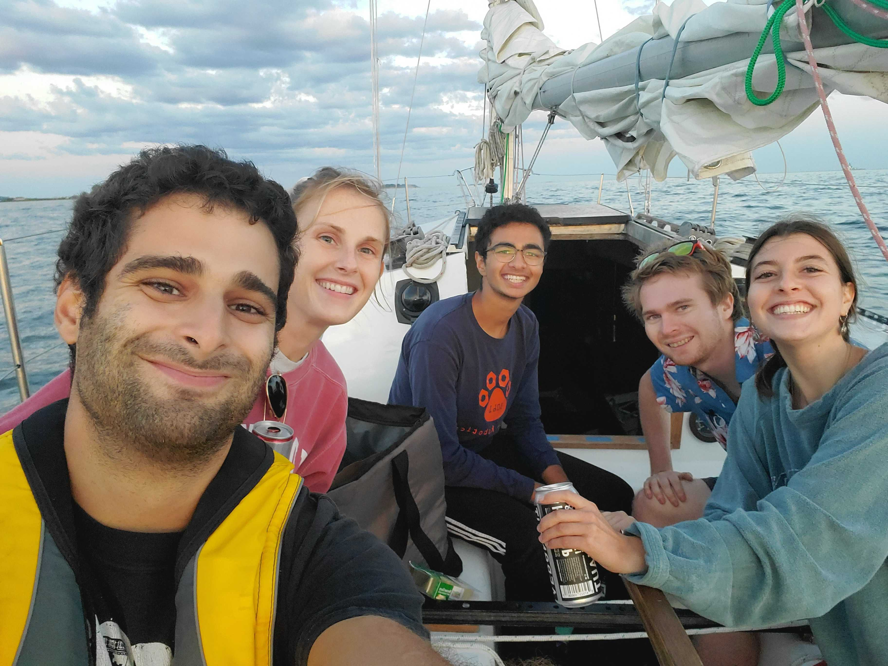

Heyo peeps – 

Just finished up my ‘first-year internship’ at [Acoustic Wells](https://acoustic-wells.com/) (AW), an Internet of Things (IOT) startup in Greentown labs, a climate-tech incubator. AW works on end-to-end automation and efficiency improvements for oil wells via IOT. I worked as a ‘hardware’ or EE intern designing, testing, and debugging PCB’s & writing firmware for sensing and datalogging IOT units. 

I’m super grateful to everyone who made it possible for me to have had this opportunity during 2020. After a summer of onsite work, here are my top takeaways. 

> A quick note - while I worked there, AW hardware was in a prototyping & early development phase - our focus was on designing systems that worked and ones we could deploy ASAP. We spent much less time simulating & testing systems to be robust in the long term.

## General Engineering-y Learnings: 

#### Documentation 💯

- Document every single change between product/prototype revisions, and make documentation a part of your team culture as early on as possible – it will save you lots and lots of wasted time. It is 100% worth it. 
- We learned this the hard way, where a couple quick, smart design decisions, baked into an early board revision, went undocumented and may have been excluded in a later version. 😬 Rookie mistake.  

#### Design Reviews 

- Similarly, having a dialed in, excellent design review process where the senior engineers get dedicated (ideally paid) time to review younger engineer’s designs/work before being sent off to production will make a world of a difference. If you have interns, give them dedicated design reviews. 
- It's an investment into **not making obvious mistakes** and into the intern's long term learning. 

#### Lean hardware prototyping

- When prototyping, at a higher monetary cost but in the notion of saving time and following a ‘lean ideology’, use predesigned systems wherever possible. 
- Like using [Adafruit’s MMA8451 accelerometer breakout board](https://learn.adafruit.com/adafruit-mma8451-accelerometer-breakout) instead of directly using the [MMA8451 accelerometer chip](https://www.mouser.com/ProductDetail/NXP-Semiconductors/MMA8451QT?qs=nf24X8JpkflIa2CupKIQ%252BA%3D%3D). From there, work backwards, adding in more ‘custom-designed’ complexity as you go to reduce price in final production. 

#### The ideology of good debugging: 

- [ ] Problem isolation – When your entire system doesn't work, the first question to ask is whether the the problem is a result of your system or of your testing enviornment. 

> When testing sensing circuitry in particular, always try testing first in a Faraday Cage (an RF-free env.) and then outside of the cage – the difference may be surprising. Problems in analog circuits dealing with low value signals in particular often come down to elmininating RF noise.

> Beware of shitty instrumentation, especially if purchased from China. Your instrumentation is technically part of your test enviornment too. 

- [ ] The second step, if you've narrowed down the problem to your system and not your testing enviornment, is to *isolate the nonworking node within your system* - to find the weak link and test all points of failure from that weak link, outwards.
- [ ] There may be some nodes in your system that you know should work - 'stock' electronics or code, like the MMA8451 breakout board, or like the classes and functions your genius coworker wrote that *can't be wrong*. Get those working first, or figure out why they aren't working, and move outwards from there. 
- [x] When testing electronics know when to use a multimeter vs a scope.
- [x] There's no IDE or debugger for electrical hardware that checks the equivalent of typos or incorrect variable typing. EE's equivalent to typos - shitty soldering - has been the downfall of many prototype circuits. 

## EE & Hardware-specific Learnings
- Chinese manufacturing is slow (shipping-wise) and dirt cheap. It'll usually take multiple overseas orders to perfect the manufacturing process.  
- There’s always a IC or chip to do exactly what you need! It might not be labeled correctly or described the way you might expect it to be, it might be in an entirely different category on your electronic component supplier, but it exists and will save you a headache / tons of work if you can find it.
- Use circuit simulators like LT-Spice wherever and whenever you can, if ever in doubt. 

## It would be nice to have ... 
- A **complex circuit / hardware debugging tool** that learns from the chips you use, the mistakes you (/engineers in general make), knows the general ‘tricky/tripup’ parts of each class of IC's or type of functional group within a circuit . Anyone can slap a PCB design together, but (to an extent) the hard and time consuming part is always debugging. The equivalent of an IDE or a debugger for a PCB that could walk you through the debugging process for your specific context would be slick.  
- Having a team with one good engineer (one who is productive, effective, and likable) and 3 mediocre ones is **infinite** times better than having a team with all mediocre engineers – investing in one good engineer makes a world of a difference. They can complete tasks fast, keep up morale, and complete deliverables to complement the rest of the team really nicely. It’s all about balance. On a side note, I’m sure that having a team of all ‘good’ engineers is too expensive or infeasible for most startups/companies.

That’s it for my takeaways. I’ll try to jump around to different fields for future internships and try firmware / embedded systems design in the future; but ultimately we’ll see what 2021 has in store. 

Also, a huge shoutout to my coworkers and boss. They rock. Love you Sara, Colin, Seb, Ben, and the rest of the AW team. If you guys ever need my help when you decide to pivot to cleantech, let me know. 

  