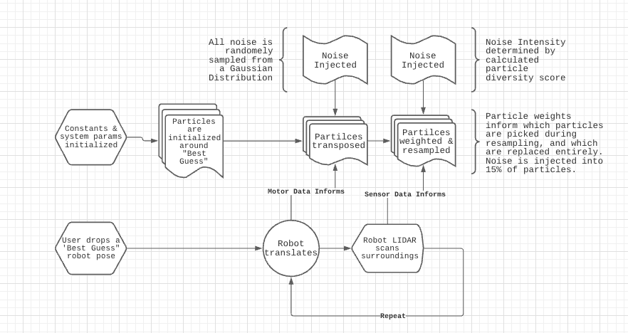
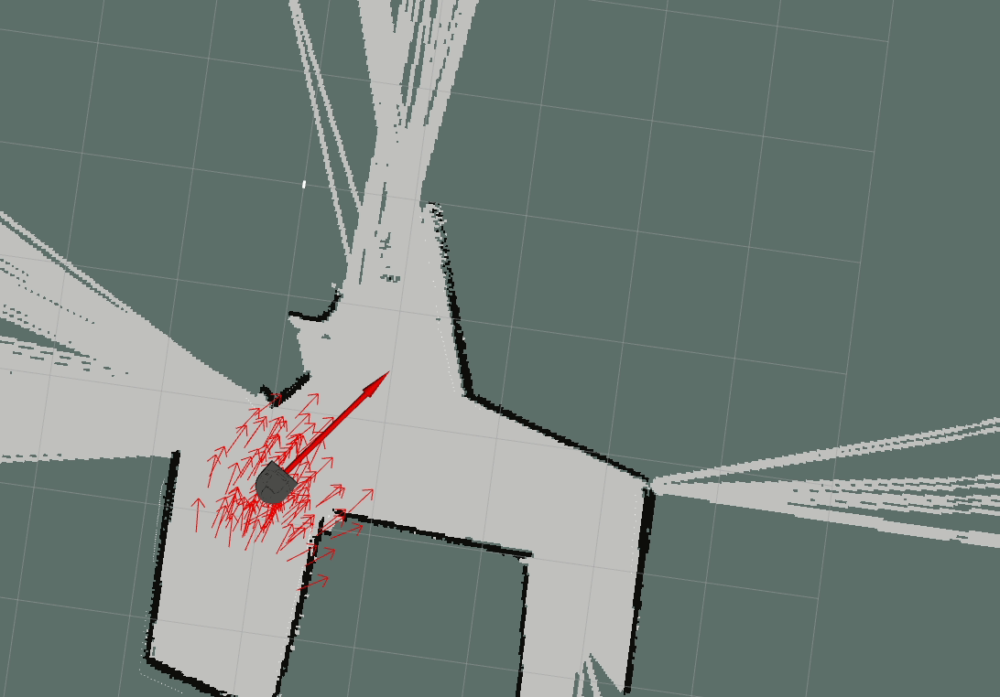
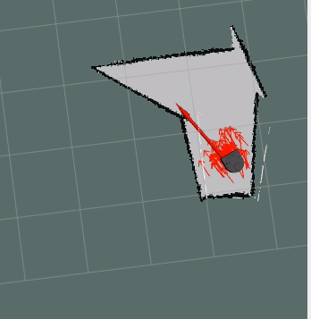
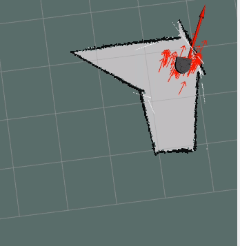

Whatup!

Today I'll be discussing a neat little robotics software project I recently completed for my [Computational Introduction to Robotics course](https://via.hypothes.is/https://comprobo20.github.io/)! I worked with [Nathan Faber](https://github.com/teadetime) to build a particle filter for a Neato cleaning robot (similar to a roomba) using ROS and python, visualized with RVIZ and simulated in Gazebo! 

**tl;dr - one of my favorite projects by far! It was less of an exercise in good software engineering practices and more of one in interesting algorithm design; here's our [codebase](https://github.com/aramachandran7/robot_localization) the final result -->** 

## A little background on robot localization and particle filters!

The objective of our software is to localize (or locate) our robot within a known physical context. In other words, using current robot sensor data and past motor movements (along with the associated probabilistic robot sensor and motor models), and using a map of the overall space, we seek to predict the robot’s current state - or it’s position in physical space. 

The naive approach to localization is via a discrete Bayes filter - here, we know there are n discrete states (or positions & orientations) our robot could be in. For every time step t, we simply compute the probability of our robot being in each one of these states, and pick the highest one. We’ll figure out, with a little math, that the time complexity of this computation is a simple O(N^2) - (AKA it’s really slow). 

We can take a few steps to shave this process down and save ourselves some pain. What if, instead of computing the probability of our robot being in every single state, we only computed the probability for a select group of states that’s more relevant? What if we used the robot’s sensor data and motor data to inform these possible states - and narrow them down even further? 

We could consider each possible state (we’ll call these particles from now on) to be a possible robot position, and we could compare the robot’s current scan data with each particle, superimposed on the known map. Now, we know the likelihood or viability that each particle is actually where the robot is!

As the robot moves through the map, we transpose each particle and recalculate weights based on the particle’s likelihood. Poor guesses at the robot’s position, or particles with lower weights, get cut out and resampled around the positions of particles with higher weights. Ultimately, as the process continues the robot is exposed to more surroundings that help its particles converge to an accurate representation of its position.

## An overview of our implementation 
The implementation of our particle filter can be broken down into several steps that get repeated throughout time. Below is a block diagram & high level explanation how we specifically applied the filter. 

### Some specifics of our setup 
- Using ROS (Robot Operating System), Python's ROS API to interact with a NEATO robot simulated in Gazebo and visualized entirely with RVIZ
- Using the Neato's default LIDAR scan data on the ROS `/scan` topic for sensor data, publishing our particles as visualizable markers to `/particlecloud` topic, and driving the Neato via the `/cmd_vel` topic 

### Algorithm Walkthrough
#### Setup
We start by initializing system constants and params, and require user to drop a "best guess" of the Neato's starting position. Create an initial particle set around that “best guess” pose. 

#### As the robot moves
- Map the robot’s movement onto each particle as if the robot was at each particle’s position
- While translating particles, add noise to compensate for the robot’s odometry measurements - (the robot's motor model and onboard encoders aren't perfect)
- Scan the surroundings with the LIDAR sensor
- Project the lidar scan as if it were from each different particle pose
- Assign a weight to each particle based on how similar the mapped scan is to the ground truth “map”
- During particle resampling based off assigned weights, retain 85% of particles from the previous particle distribution, with their weights as probabilities in choosing
- For the final 15%, sample from the same distribution, but inject noise for each particle position (this variability is key in the event that our current particles don’t reflect the robot’s position)
- If particles have condensed too much, then add variability - we'll cover this more in depth later! (This helps the particle filter continue to work as error accumulates)
- Repeat indefinetly!

As this process repeats the point cloud should converge onto the actual position of the robot. Changing parameters such as the amount of resampling done or the amount of noise injected changes how the particle filter behaves.

The large red arrow is the ground truth position of the robot. The small red arrows represent our particles. The particles should stay relatively condensed around the larger red arrow. The (hard to see) white lines are the lidar scan of the robot superimposed onto the map.

A smaller map where the PF performed worse: 

The same map as above, with fewer total particles: 

## Let's talk about some of our core design decisions - 

### How we calculated particle weights
In order to quantify which particles were 'better guesses' at the robot's state than others, we set each particle's weight using the Neato's LIDAR scan data. This can by walking through all particles, and for each particle, walking through each of the robot's LIDAR scan points projected to the particle's frame. From there, project this onto the actual map and determine the distance from the nearest actual obstacle. Append each distance to an array, with 1 array for each particle. 

Apply a Gaussian 'squish' to each point, cube the result, and sum the entire thing to calculate one particle's weight (between 0 and 1). The result looks like 

`particle_weight = sum([((e/(d)**2))**3 for d in array])` 

We settled on this weight calculation to heavily emphasize values of `d` closer to 0, and strongly diminish values of `d` higher than 1. 

### Using `n_effective` for dynamic noise injection
Let's think about injecting noise into each particle during resmapling. How do you build a system that is aware of how varied or diverse its particles are, and one that can adjust how much noise it injects based on that 'diversity score'? In other words, how do you make sure you don’t go in blind when injecting noise?

We use `n_effective` to store our calculated variance or diversity score of sorts. The more diverse our particles and the wider our spread, the better our system is at handling out of the ordinary edge cases - like if the robot were kicked, for example. (Note that we also want our particles to condense fairly well for an accurate best guess at the robot's position). 

To calculate `n_effective`, we sum the square of each particle weight, and divide the result by 1. It looks a bit like 

`n_effective = 1 / sum([w**2 for w in weights])`. 

This model for `n_effective` grants your filter a higher score for a more diverse set of (possibly shitty) weights, and a lower score for a lot of low scores and couple high scores. 

When injecting noise, the standard deviation of the Guassian noise (reference `numpy.random.normal`) is proportional to `1/n_effective`. This method has its downsides - it's directly dependant on the number of particles in the system, and must be finely tuned depending on the context in order for it to not 'over-prioritize' variation in particle positions. 

## Let's talk about some of our challenges - 

In general, debugging the system came down to writing incremental bits of code / logic and testing as often as possible.  

Jumping between the different geometric coordinate frames was tough. The lidar scan, the robots in-built odometry, and the robot itself all lived in different coordinate systems and must be transformed between. These are pretty tough to conceptualize. Luckily the `tf` module takes care of much of the work behind the scenes. This was likely the largest conceptual hurdle for us to overcome.

Later in the project, we faced some issues injecting noise and variability into our filter. Even after rooting out some simple bugs, we realized that setting an appropriate noise level and ensuring a reasonable variation in the particles was no small feat, and required a ridiculous amount of fine-tuning. It was very easy to come out with an overly or not aggressive particle filter. We eventually switched to the `n_effective` method, which isn’t perfect but is an improvement. 

## Results & future improvements

This project's ultimate goals were more centered around learning and less around performance - with that said, there's no doubt this particle filter leaves some to be desired. It works decently when given an accurate initial estimate and a clean map with time & patience to lock in its best guess of the robot's state. However, in the real world, we're guaranteed none of those as a baseline, and must take more time to consider and account for edge cases. 

For starters, we'd recommend further testing in more complex enviornments to better understand and quantify the failiure modes of our system. **Writing some automated simulations / tests and assigning performance scores would be sick.** 

We'd also recommend varying the algorithm's finer numbers before making any larger architecture changes - 

- Vary not only the noise, but the number of particles resampled based on the variance score `n_effective`
- Experiment with higher and lower numbers of particles depending on map characteristics 
- Improve and tune in motor model/noise injection 

**Interesting larger architecture changes to consider -** 

- Optimize code for memory and time complexity to enable a faster timestep - our code is currently **quite poorly** optimized. 
- Detect if the particle cloud has diverged and work to resolve the divergence using clustering algorithms - this would be really neat to explore.
- Experiment with more versatile ways of computing the best guess robot location than a weighted average of particle position. 

**In all,** this was a great intro to robotics algorithms, and there's clearly tremendous room to learn and grow, particularly in the testing department. **Hope you got as much out of this as we did!**

~Till next time!~